#帮助手册

## 基础按键
### 设置

* 	<b>资源定义生成</b>  
     上传自定义的可结构化内容到arceus，该内容将被arceus转换为arceus平台的定义文件等待被使用，如构建一个自制类型的yaml文件：
* 	<b>资源上传解析</b>  
     将上传的资源解析为arceus平台资源，如模版(Template)

### 折叠 \ 展开全部

  

折叠 \ 展开下方所有已显示的资源

### 解析 、构建

  

将右侧代码块内的资源解析到左侧、将左侧的资源构建为配置文件到右侧

### 快速开始

  

选择一种规则，填写自定义YAML内容，系统会根据选择的规则和自定义的YAML内容自动生成YAML文件并显示到右侧代码框内。  

### 复制、下载

  

提供一键复制右侧代码框内的代码，将右侧代码框内的代码生下载为YAML文件到本地的功能

## 操作面板
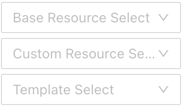  

### 资源选择
  

选择所需要构建的资源类型，在下方的字段型资源中开始构建对应的yaml文件

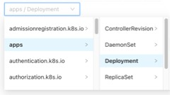

#### 测试用例

<b>通过点击字段名进行构建</b>

我们部署一个简单的Deployment类型的资源：

1. 选择成功后下方选择器中即会显示基础资源的类型:  
   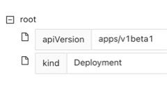
2. 点击对应的字段名可选择删除该字段，以及提示该字段下可选择的字段名称，点击显示的任意需要的字段即可  
   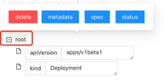
3. 鼠标悬停在字段名上，显示该字段的解释介绍  
   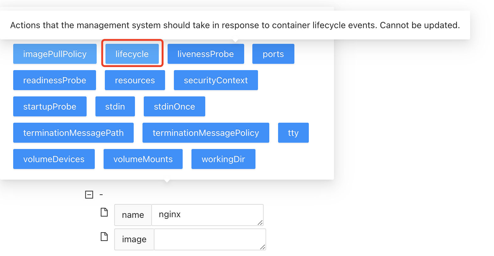
4. 点击上方构建按钮将制作完成的资源构建为YAML文件  
   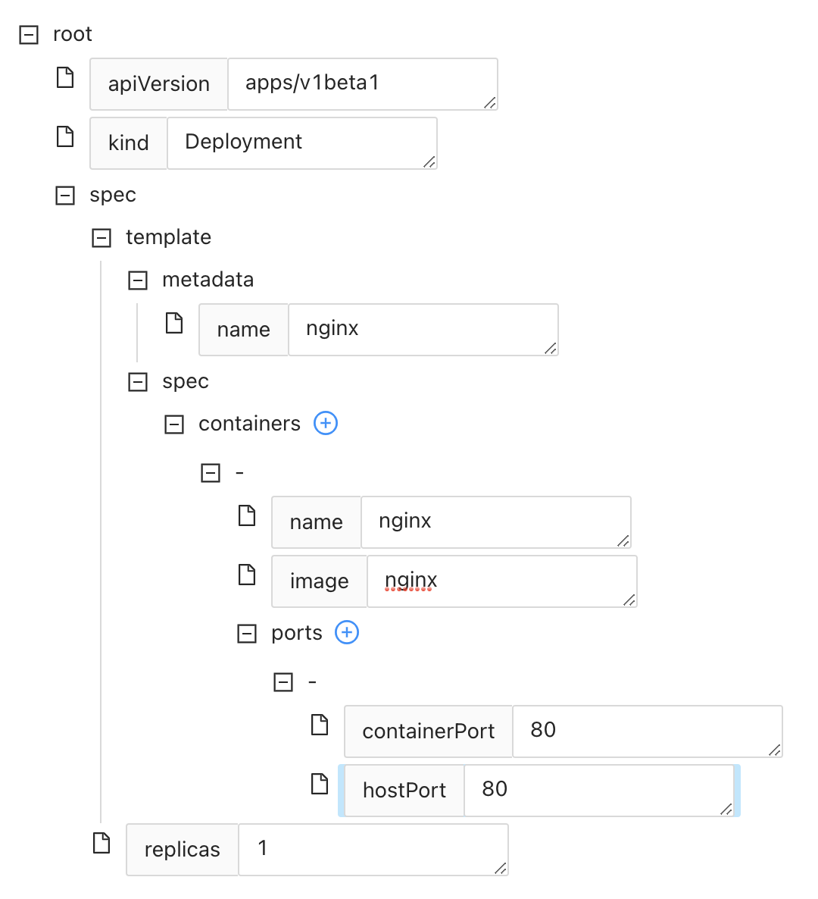  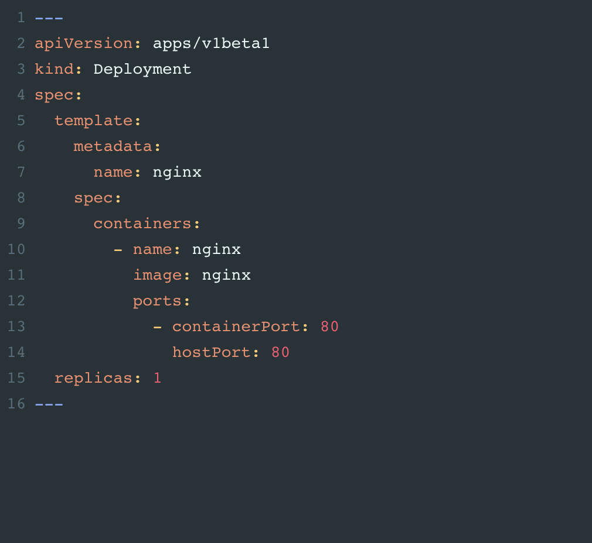

<b>通过写YAML文件的方式进行构建 </b>

1. 直接在右侧代码框内编辑YAML文件内容
2. 点按control提示当前位置下可选择的字段名称。(需注意，该提示需要输入正确的空格数量)
   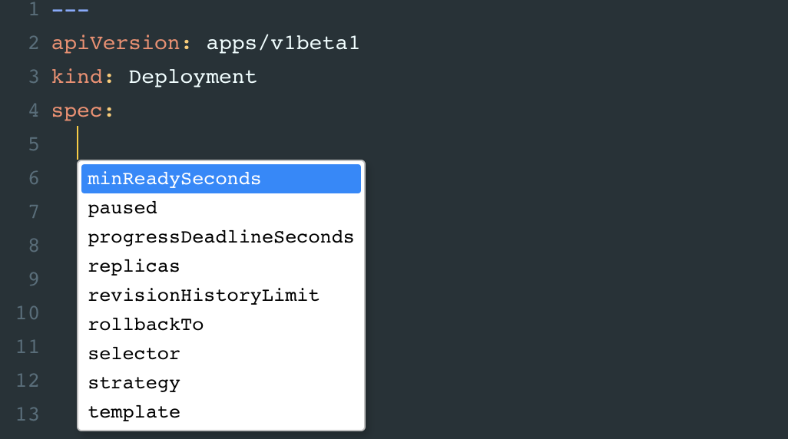
3. 编辑完成可点击上方按钮解析为字段型资源

### 自定义资源(Custom Resource Select)

#### 快速开始准则(QuickStartRule)
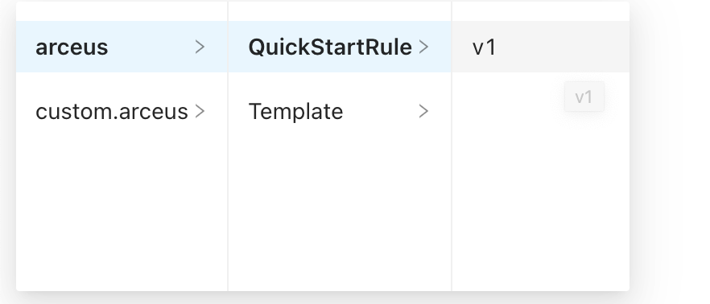  

点击arceus/QuickStartRule即可根据对应的规则快速开始

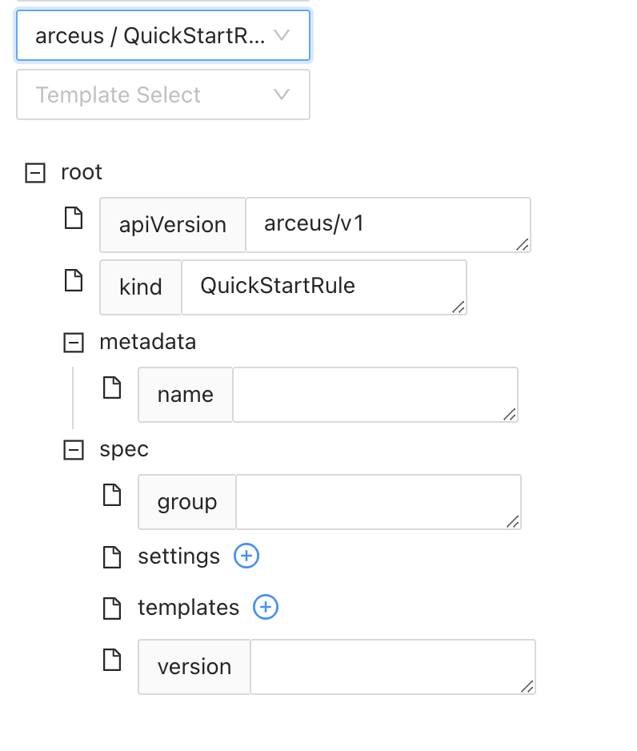  

#### 模版(Template)
点击arceus/Template可自定义一个模版：

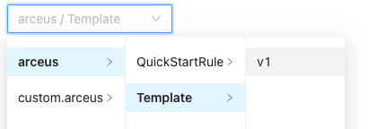  

1. 点击template字段进行添加模版，group字段可为该模版进行分组。  
   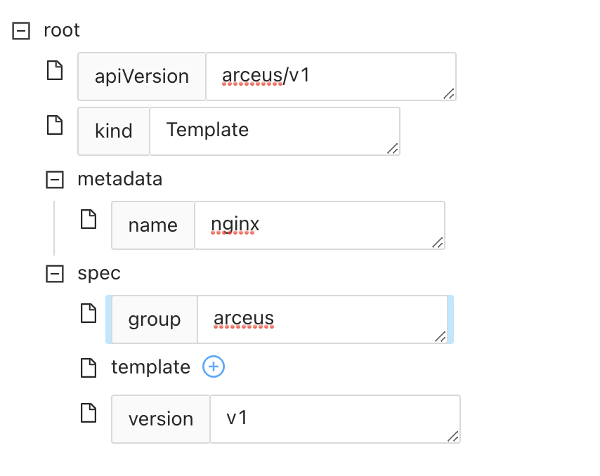

2. 构建一个Deployment资源的模版填充如下：

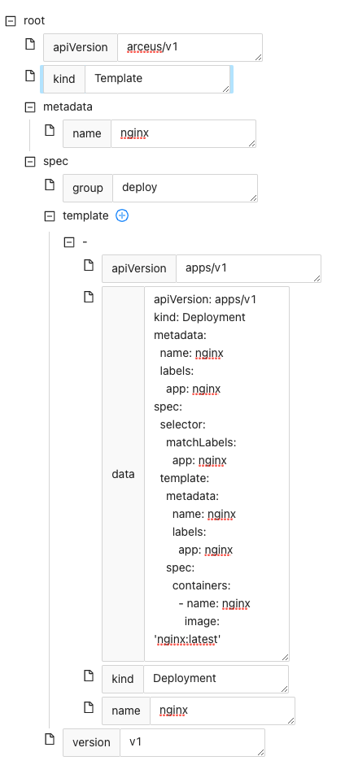  

3. 点击上方的下载按钮，将构建好的Yaml资源下载为yaml文件  
4. 点击设置中的资源上传解析，上传刚定义的yaml文件模版，显示上传成功  
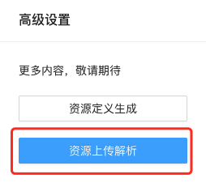   
5. 刷新网页，可在模版选择(Template Select)内找到该模版，点击即可根据该模版快速开始  

### 选择模版(Template Select)
点击选择模版(Template Select)，可获取任意模版内容并渲染为字段型资源显示至下方。
该模版可自定义生成，生成方式请见：自定义资源/模版

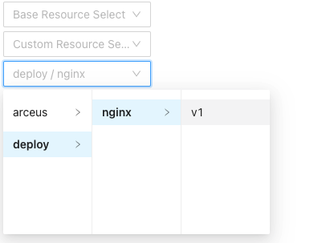  

渲染如下：

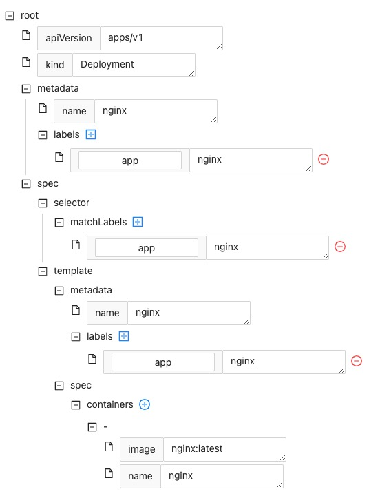